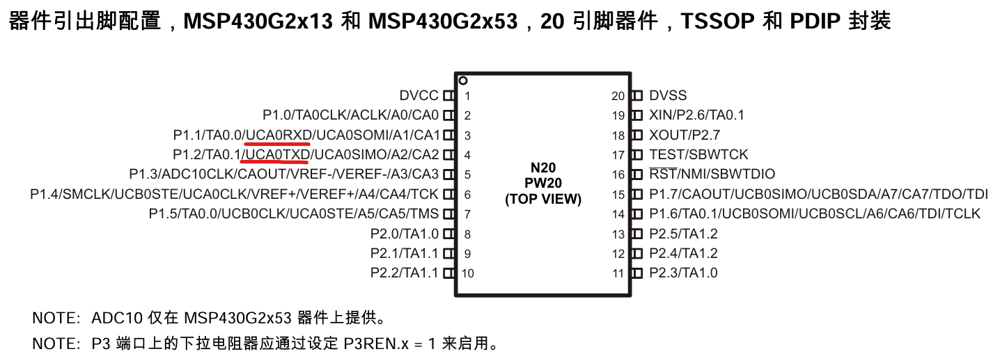
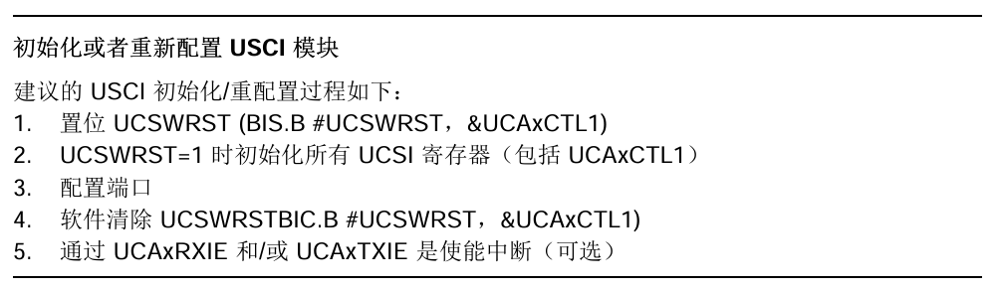

# MSP430初期开发笔记

## 学习笔记

### 1. 基本寄存器、IO操作

* `P1DIR`的功能是选择P1对应的IO端口的输入输出状态，0为输出状态，1为输入状态。
  
  * 例：`P1DIR |= BIT6; //初始化LED2所在IO口P1.6为输出模式`
  
    
  
* `P1IN`寄存器是输入寄存器，能够反映外部IO口的电平状态，**只能读不能写**。

  

* 使能IO端口内部的上下拉电阻

  * 一般来说单片机的IO端口都是高阻输入。所以，只要有一点外部干扰信号，就可以使它呈现出比较高的电平，容易被单片机误判。

  * 因此，要读取某个IO口的状态之前（例如：判断按键是否被按下），要根据需要先使能IO端口内部的上/下拉电阻。

  * 需要配置两个寄存器：

    * `PxREN`（x = 1、2）
      * 置0 -> 开关断开，失能上/下拉电阻
      * 置1 -> 开关闭合，使能上/下拉电阻
    * `PxOUT`（x = 1、2）
      * 置0 -> 连接VSS，配置为下拉电阻
      * 置1 -> 连接VCC，配置为上拉电阻


```c
/*使能P1.3口的上拉电阻*/
P1REN |= BIT3; // 使能
P1OUT |= BIT3; // 上拉
```

### 2. 时钟模块

#### 2.1 时钟源（可以产生震荡信号）：

* LFXT1CLK：低频/高频振荡器可以与低频时钟晶振或外接32768kHz时钟源，或与标准晶振、振荡器，外部400KHz～16MHz 的外部时钟源一起使用。
* DCOCLK：内部数控振荡器(DCO)。
  * 数字控制的振荡器
  * 是内部集成的RC振荡器
  * 可以由软件配置输出1MHz-16MHz左右的频率
* VLOCLK：内部超低功耗、12KHz典型频率的低频振荡器。
  * 可以得到非常低的频率（在G2553中低至12KHz）
    * 用如此低频的信号驱动单片机工作 ->  低功耗
  * 缺点：受温度影响非常大
* XT2CLK：MSP430G2553无此时钟源。

#### 2.2 时钟信号（由时钟源经过分频得到的）：

* ACLK（Auxiliary clock）：辅助/备用时钟
  * 可以由软件选择由LFXT1CLK或VLOCLK分频而来，分频系数可以取1、2、4、8。
  * 可由软件配置，作为外围模块（如定时器、ADC、串口…）的时钟。
* MCLK（Master clock）：主时钟
  * 可以由软件选择由LFXT1CLK、DCOCLK、VLOCLK或XT2CLK（如果片上提供）分频而来，分频系数可以取1、2、4、8。
  * MCLK用于CPU和系统。
    * 程序运行得有多快，是由MCLK决定的。
* SMCLK（Sub-main clock）：副主时钟
  * 可以由软件选择由LFXT1CLK、DCOCLK、VLOCLK或XT2CLK（如果片上提供）分频而来，分频系数可以取1、2、4、8。
  * 可由软件配置，作为外围模块（如定时器、ADC、串口…）的时钟。

#### 2.3 时钟配置

* 不对时钟进行配置的情况下

  * 主时钟MCLK和SMCLK都默认从DCOCLK中来（约1MHz左右），分频系数为1（DCOCLK发生的频率是多少，MCLK和SMCLK的频率就是多少）。
  * ACLK默认来自外接的32.768khz的晶振（LFXT1CLK）。

  ```c
  /*设置MCLK频率*/
  DCOCTL = CALDCO_16MHz // 将DCO的震荡频率改为16MHz（16MHz经过校准，是一个较准确的数值）
  BCSTL1 = CALBC1_16MHz
  ```

  * 注：MSP430在出厂时已经校准了1MHz、8MHz、12MHz、16MHz这四个频率点的数值，可以产生比较精准的时钟。

### 3.通用串行通信接口模块（USCI）

#### 3.1 USCI模块简介

* MSP430一般具有两个模块：
  * USCI_Ax（对于MSP430G2553，x = 0）
    * 支持：
      * UART模式
      * IrDA通信的脉冲整形
      * LIN通信的自动波特率检测
      * SPI模式
  * USCI_Bx（对于MSP430G2553，x = 0）
    * 支持：
      * IIC模式
      * SPI模式
  * MSP430G2553中，A、B模块各有一个，标号都为0。
* 故：想要使用UART模式，就必须用USCI_Ax这个模块。

#### 3.2 引脚图



P1.1：UCA0RXD，可做串口的数据接收引脚
P1.2：UCA0TXD，可做串口的数据发送引脚

* 注：看引脚旁的文字标号，不要看方框上的引脚号

#### 3.3 配置

* 第一步：配置系统时钟
* 第二步：配置串口相关
  * 手册建议：
  * 波特率（查手册中的表格）、校验位、数据位、停止位
  * 重点关注手册中UCAxCTL0（USCI_Ax控制寄存器0）和 UCAxCTL1（USCI_Ax控制寄存器1）
  * 配置端口：配置P1SEL.x和P1SEL2.x寄存器（选择端口的第二功能）。具体配置值见用户手册 -> 端口原理图部分。
  * 两次发送数据（将数据写入发送缓冲寄存器）之间要有一定的时间间隔。
    * 串口发送完一个数据是需要时间的，若在上一次数据还没有发送完时就对发送缓冲寄存器进行写入，会造成数据的发送错误。

## 踩坑记录

### 工程能够编译，但无法调试。

* CCS Theia报错：‘launch.json‘ is not a valid JSON file. Missing debug configuration properties.
* 解决方法：将默认工作区的`.theia`文件夹（包含`launch.json`）复制到当前打开的文件夹即可。

### 串口无法发送数据

* 要使用MSP430G2553板载的虚拟串口，需要将最左侧两个跳帽的插法由竖插改为横插。
* 也可以不使用虚拟串口，使用USB转串口模块。
  * P1.1 -> RXD，接收
  * P1.2 -> TXD，发送