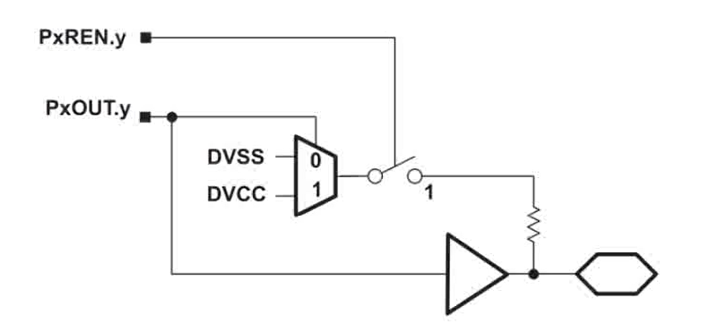

# MSP430初期开发笔记

* P1DIR的功能是选择P1对应的IO端口的输入输出状态，0为输出状态，1为输入状态。
  * 例：`P1DIR |= BIT6; //初始化LED2所在IO口P1.6为输出模式`

    
  
* P1IN寄存器是输入寄存器，能够反映外部IO口的电平状态，只能读不能写。

  

* 使能IO端口内部的上下拉电阻

  * 一般来说单片机的IO端口都是高阻输入。所以，只要有一点外部干扰信号，就可以使它呈现出比较高的电平，容易被单片机误判。

  * 因此，要读取某个IO口的状态之前（例如：判断按键是否被按下），要根据需要先使能IO端口内部的上/下拉电阻。

  * 需要配置两个寄存器：

    * PxREN（x = 1、2）

      * 置0 -> 开关断开，失能上/下拉电阻
      * 置1 -> 开关闭合，使能上/下拉电阻
    * PxOUT（x = 1、2）
      * 置0 -> 连接VSS，配置为下拉电阻
      * 置1 -> 连接VCC，配置为上拉电阻



```c
/*使能P1.3口的上拉电阻*/
P1REN |= BIT3; // 使能
P1OUT |= BIT3; // 上拉
```