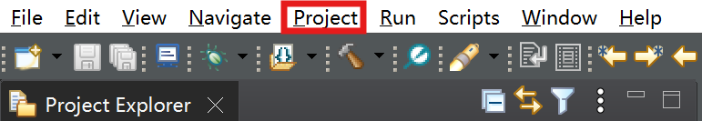
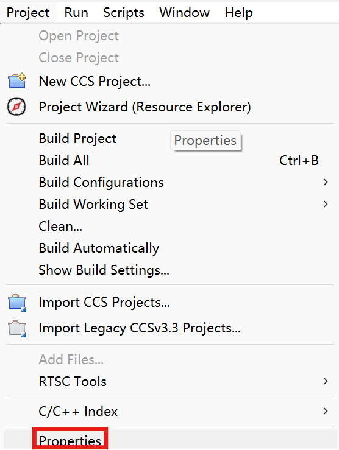
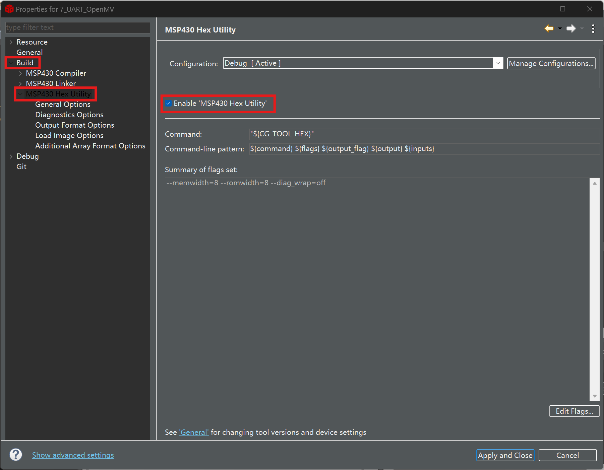
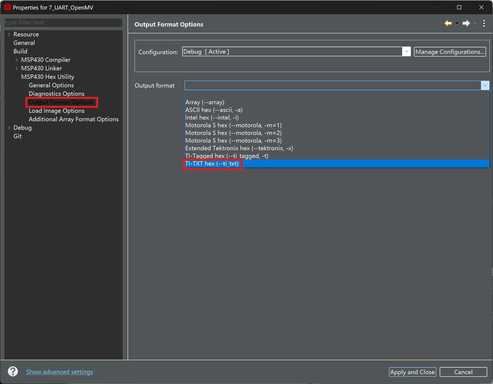
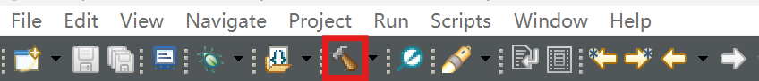
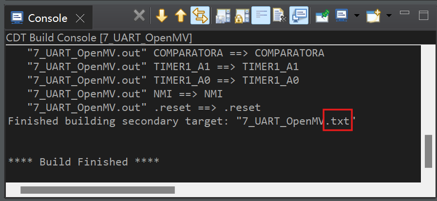

# CCS中配置项目输出txt文件

### 1. 工具栏Project

### 2. 选择最下面Properties

### 3. Build -> MSP430 Hex Utility  -> 勾选Enable 'MSP430 Hex Utility'

### 4. Options Format Output -> Output format ->  选择最后一个：TI-TXT hex ( -- ti_txt)

### 5. 再次Build

console窗口显示的target后缀名显示为txt则以上步骤成功。

注：此txt文件在工程目录下的Debug文件夹内。
